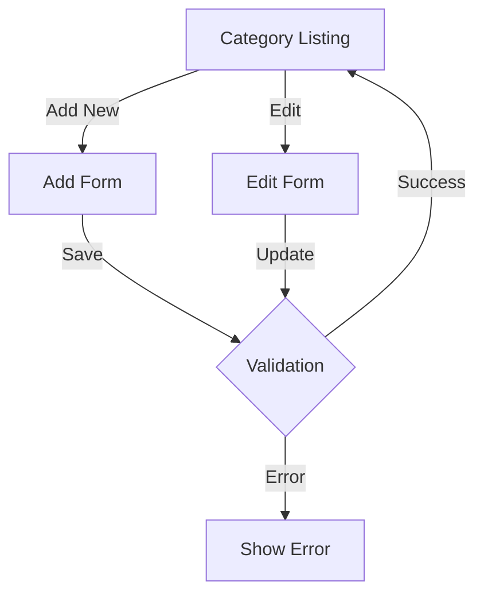

# Categories Controller Documentation

## Overview
The `CategoriesController` manages product category operations in the Health Deals Admin system. It provides functionality for creating, updating, and managing product categories, including their visual representation through color coding.

## Dependencies
- `App\Models\Category` - Category model
- `Slim\Exception\HttpNotFoundException` - Exception handling

## Methods

### `index(Request $request, Response $response)`
Displays the category listing page.
- **Method**: GET
- **Route**: `/categories`
- **Template**: `categories/index.php`
- **Response**: Rendered category listing page with all categories

### `add(Request $request, Response $response)`
Handles category creation.
- **Method**: GET/POST
- **Route**: `/categories/add`
- **POST Parameters**:
  - `name` (string) - Category name
  - `slug` (string) - URL-friendly identifier
  - `is_active` (boolean) - Category status
  - `color` (string) - Hex color code for category badge
- **Template**: `categories/form.php`
- **Response**: Redirects to category listing on success

### `edit(Request $request, Response $response, array $args)`
Handles category updates.
- **Method**: GET/POST
- **Route**: `/categories/edit/{id}`
- **Parameters**: Same as `add()` method
- **Template**: `categories/form.php`
- **Response**: Redirects to category listing on success

## Category Management Flow



## Features

### 1. Category Management
- Category CRUD operations
- Slug generation
- Color coding support
- Active status control
- Category listing

### 2. Visual Customization
- Color picker for categories
- Badge color management
- Visual status indicators
- Category styling options

### 3. Data Validation
- Name uniqueness
- Slug formatting
- Color code validation
- Required field validation

## Category Structure

### Category Model
```php
class Category {
    public $id;
    public $name;
    public $slug;
    public $color;
    public $is_active;
    public $created_at;
    public $updated_at;
}
```

### Color Management
- Default color: `#6c757d`
- Format: 6-digit hex color code
- Includes color picker in form
- Supports visual preview

## Error Handling

1. **Input Validation**:
   - Required field validation
   - Slug format validation
   - Color code validation
   - Name uniqueness check

2. **Error Responses**:
   - Form validation errors
   - Database error handling
   - Not found handling
   - Friendly error messages

3. **Error Logging**:
   - Error message logging
   - Validation failure logging
   - Database error tracking
   - Operation failure logging

## Usage Examples

### Web Interface
```php
// Add new category
POST /categories/add
Content-Type: application/x-www-form-urlencoded

name=Health+Supplements&slug=health-supplements&color=%236c757d&is_active=on

// Update category
POST /categories/edit/123
Content-Type: application/x-www-form-urlencoded

name=Updated+Category&color=%23ff0000&is_active=on
```

## Best Practices

### 1. Category Creation
- Generate clean slugs
- Validate color codes
- Check name uniqueness
- Set default values
- Maintain consistency

### 2. Category Updates
- Preserve relationships
- Track modifications
- Validate changes
- Update timestamps
- Maintain history

### 3. Category Display
- Consistent color usage
- Clear visual hierarchy
- Intuitive navigation
- Status indicators
- Responsive design

## Implementation Details

### Slug Generation
```php
// Convert name to slug
$slug = strtolower($name);
$slug = preg_replace('/[^a-z0-9]+/', '-', $slug);
$slug = trim($slug, '-');
```

### Color Validation
```php
// Validate hex color code
if (!preg_match('/^#[a-f0-9]{6}$/i', $color)) {
    $color = '#6c757d'; // Default color
}
```

### Category Creation
```php
$category = new Category(
    $name,
    $slug,
    $isActive,
    $color
);
$category->save();
```

## Security Considerations

### 1. Input Sanitization
- Name sanitization
- Slug sanitization
- Color code validation
- XSS prevention

### 2. Access Control
- Authentication required
- Authorization checks
- Session validation
- CSRF protection

### 3. Data Protection
- Input validation
- Output escaping
- Error handling
- Secure updates

## Future Enhancements

1. **Category Hierarchy**:
   - Parent-child relationships
   - Nested categories
   - Category trees
   - Hierarchy management

2. **Advanced Features**:
   - Category images
   - Description support
   - Meta information
   - SEO attributes

3. **UI Improvements**:
   - Drag-and-drop ordering
   - Bulk operations
   - Advanced search
   - Filter options

## Integration Points

### 1. Product Integration
- Category assignment
- Product filtering
- Category navigation
- Product organization

### 2. Deal Integration
- Deal categorization
- Category-based deals
- Deal filtering
- Category statistics

### 3. API Integration
- Category endpoints
- Data synchronization
- External access
- Integration support 