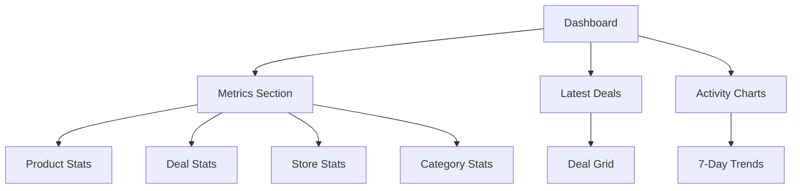

# Dashboard Controller Documentation

## Overview
The `DashboardController` manages the main dashboard of the Health Deals Admin system. It provides an overview of system metrics, recent activities, and key performance indicators (KPIs) for products, deals, stores, and categories.

## Dependencies
- `App\Models\Category` - Category metrics
- `App\Models\Deal` - Deal metrics and latest deals
- `App\Models\Product` - Product metrics
- `App\Models\Store` - Store metrics

## Methods

### `index(Request $request, Response $response)`
Renders the main dashboard page with system metrics and latest deals.

- **Method**: GET
- **Route**: `/dashboard`
- **Template**: `dashboard/index.php`
- **Response**: Rendered dashboard page with:
  - System metrics
  - Latest deals
  - Activity charts

#### Metrics Provided
1. **Product Metrics**:
   - Active products count
   - Products added per day (7-day trend)

2. **Deal Metrics**:
   - Active deals count
   - Deals added per day (7-day trend)

3. **Store Metrics**:
   - Active stores count

4. **Category Metrics**:
   - Active categories count

5. **Latest Deals**:
   - Shows 18 most recent deals
   - Includes deal details and status

## Dashboard Layout



## Features

### 1. Metrics Overview
- Real-time system statistics
- Active item counts
- Trend analysis
- Performance indicators

### 2. Latest Deals Display
- Recent deal showcase
- Deal status indicators
- Quick access to deal details
- Grid layout presentation

### 3. Activity Tracking
- 7-day trend analysis
- Product addition tracking
- Deal creation monitoring
- System activity overview

## Data Collection Methods

### Product Statistics
```php
// Active products count
Product::countActive()

// Products per day (7-day trend)
Product::getProductsPerDay(7)
```

### Deal Statistics
```php
// Active deals count
Deal::countActive()

// Deals per day (7-day trend)
Deal::getDealsPerDay(7)

// Latest deals
Deal::getLatestDeals(18)
```

### Store Statistics
```php
// Active stores count
Store::countActive()
```

### Category Statistics
```php
// Active categories count
Category::countActive()
```

## Usage

### Accessing the Dashboard
```php
// View dashboard
GET /dashboard
```

### Example Response Structure
```php
[
    'metrics' => [
        'activeProducts' => int,
        'productsPerDay' => [
            'dates' => array,
            'counts' => array
        ],
        'activeDeals' => int,
        'dealsPerDay' => [
            'dates' => array,
            'counts' => array
        ],
        'activeStores' => int,
        'activeCategories' => int
    ],
    'latestDeals' => [
        [
            'id' => int,
            'title' => string,
            'deal_price' => float,
            'original_price' => float,
            'is_featured' => boolean,
            'is_expired' => boolean,
            // ... other deal fields
        ],
        // ... up to 18 deals
    ]
]
```

## Best Practices

### 1. Performance Optimization
- Cache frequently accessed metrics
- Optimize database queries
- Implement lazy loading
- Use efficient data aggregation

### 2. Data Presentation
- Clear metric visualization
- Intuitive layout design
- Responsive grid system
- Real-time updates when possible

### 3. Maintenance
- Regular cache clearing
- Data accuracy verification
- Performance monitoring
- Error logging

## Error Handling

1. **Data Collection Errors**:
   - Graceful fallback for missing data
   - Error logging
   - Default values for failed metrics
   - User-friendly error messages

2. **Display Issues**:
   - Responsive design fallbacks
   - Data format validation
   - Layout adjustment handling
   - Loading state management

## Security Considerations

1. **Access Control**:
   - Authentication required
   - Session validation
   - Role-based access
   - Secure data transmission

2. **Data Protection**:
   - Sensitive data filtering
   - XSS prevention
   - CSRF protection
   - Input sanitization

## Future Enhancements

1. **Additional Metrics**:
   - Revenue tracking
   - User activity monitoring
   - Conversion rates
   - Performance analytics

2. **Interactive Features**:
   - Custom date ranges
   - Metric filtering
   - Export capabilities
   - Real-time updates

3. **Visualization Improvements**:
   - Interactive charts
   - Customizable dashboards
   - Advanced analytics
   - Trend predictions 