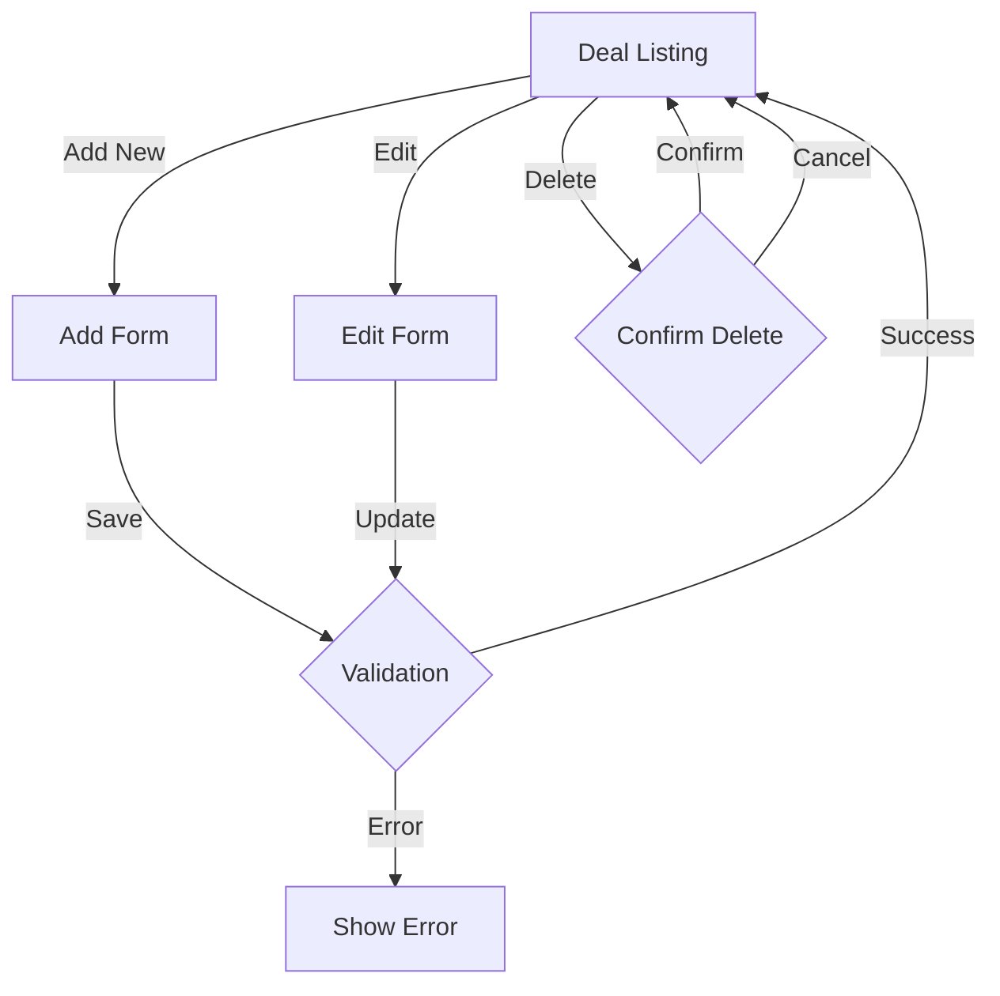
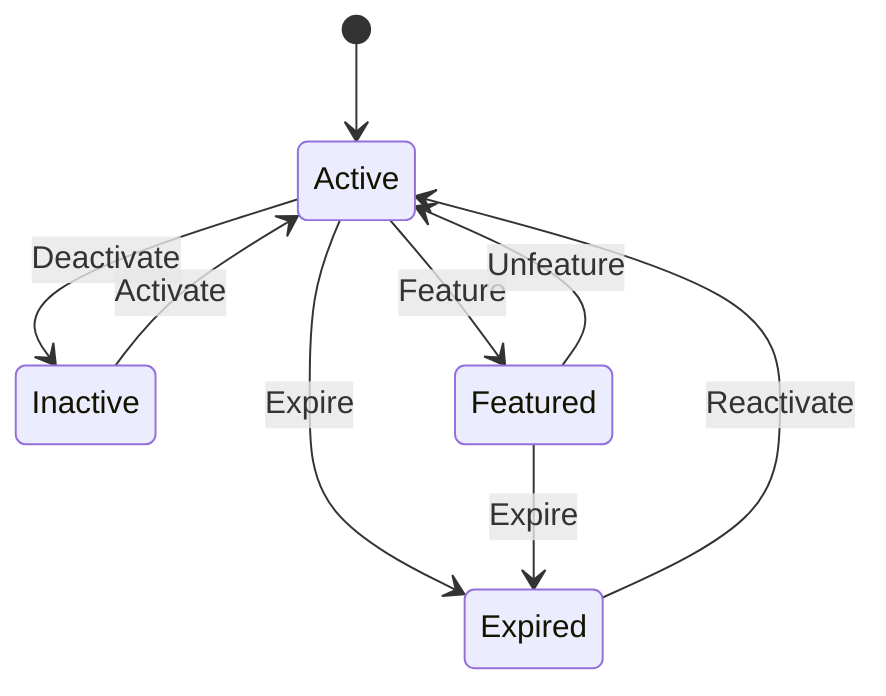

# Deals Controller Documentation

## Overview
The `DealsController` manages deal-related operations in the Health Deals Admin system. It handles the creation, management, and tracking of product deals, including featured deals and deal status management.

## Dependencies
- `App\Models\Deal` - Deal model
- `App\Models\Category` - Category model
- `App\Models\Store` - Store model
- `App\Models\Product` - Product model

## Methods

### Web Interface Methods

#### `index(Request $request, Response $response)`
Displays the deal listing page with filtering and pagination.
- **Method**: GET
- **Route**: `/deals`
- **Query Parameters**:
  - `page` (int) - Page number (default: 1)
  - `per_page` (int) - Items per page (default: 20, max: 100)
  - `keyword` (string) - Search term
  - `store_id` (int) - Filter by store
  - `category_id` (int) - Filter by category
  - `is_active` (string) - Filter by status
  - `sort_by` (string) - Sort field (default: created_at)
  - `sort_order` (string) - Sort direction (ASC/DESC)
- **Template**: `deals/index.php`
- **Response**: Rendered deal listing page with:
  - Deal list
  - Pagination data
  - Filter options
  - Sorting options
  - Store list
  - Category list

#### `add(Request $request, Response $response)`
Handles deal creation.
- **Method**: GET/POST
- **Route**: `/deals/add`
- **POST Parameters**:
  - `title` (string) - Deal title
  - `description` (string) - Deal description
  - `affiliate_url` (string) - Affiliate link URL
  - `image_url` (string) - Deal image URL
  - `product_id` (int) - Associated product ID
  - `store_id` (int) - Store ID
  - `category_id` (int) - Category ID
  - `original_price` (float) - Original product price
  - `deal_price` (float) - Deal price
  - `is_active` (boolean) - Deal status
  - `is_featured` (boolean) - Featured status
  - `is_expired` (boolean) - Expiration status
- **Template**: `deals/form.php`
- **Response**: Redirects to deal listing on success

#### `edit(Request $request, Response $response, array $args)`
Handles deal updates.
- **Method**: GET/POST
- **Route**: `/deals/edit/{id}`
- **Parameters**: Same as `add()` method
- **Template**: `deals/form.php`
- **Response**: Redirects to deal listing on success

#### `delete(Request $request, Response $response, array $args)`
Handles deal deletion.
- **Method**: POST
- **Route**: `/deals/delete/{id}`
- **Response**: Redirects to deal listing

## Deal Management Flow



## Features

### 1. Deal Listing
- Pagination support
- Advanced filtering
- Sorting capabilities
- Featured deals management
- Active/inactive status
- Expiration status

### 2. Deal Management
- Product association
- Store association
- Category association
- Price tracking
- Affiliate link management
- Image management
- Featured status
- Expiration status

### 3. Deal Validation
- Price validation
- URL validation
- Required field validation
- Status management

## Error Handling

1. **Input Validation**:
   - Required field validation
   - Price format validation
   - URL format validation
   - Status validation

2. **Error Responses**:
   - Form validation errors
   - Database error handling
   - Friendly error messages
   - Error state preservation

3. **Security**:
   - Authentication required
   - Input sanitization
   - XSS prevention
   - CSRF protection

## Usage Examples

### Web Interface
```php
// Add new deal
POST /deals/add
Content-Type: application/x-www-form-urlencoded

title=Summer+Sale&product_id=123&store_id=1&deal_price=79.99&original_price=99.99

// Update deal
POST /deals/edit/123
Content-Type: application/x-www-form-urlencoded

title=Updated+Deal&is_active=on&is_featured=on

// Delete deal
POST /deals/delete/123
```

## Deal Status Management

### Status Types
1. **Active Status** (`is_active`):
   - Controls deal visibility
   - Affects listing filters
   - Used for temporary deal suspension

2. **Featured Status** (`is_featured`):
   - Highlights important deals
   - Used for promotional purposes
   - Affects deal sorting/display

3. **Expiration Status** (`is_expired`):
   - Marks deals as expired
   - Affects deal visibility
   - Used for deal lifecycle management

### Status Transitions


## Best Practices

1. **Deal Creation**:
   - Verify product availability
   - Validate price differences
   - Check affiliate link validity
   - Optimize deal images
   - Set appropriate categories

2. **Deal Management**:
   - Regular status updates
   - Price verification
   - Expired deal cleanup
   - Featured deal rotation
   - Category organization

3. **Performance Considerations**:
   - Efficient filtering
   - Optimized queries
   - Image size management
   - Pagination implementation
   - Cache utilization 