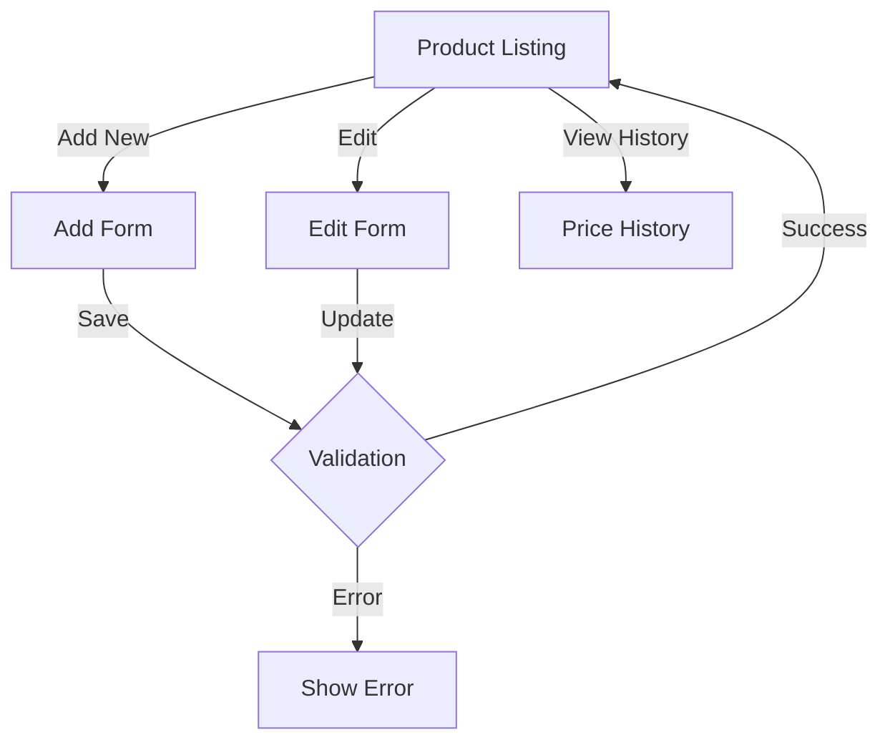

# Products Controller Documentation

## Overview
The `ProductsController` manages all product-related operations in the Health Deals Admin system. It handles both web interface interactions and API endpoints for product management, including CRUD operations, price history tracking, and product information scraping.

## Dependencies
- `App\Models\Product` - Product model
- `App\Models\Category` - Category model
- `App\Models\Store` - Store model
- `App\Models\User` - User model
- `App\Models\PriceHistory` - Price history model
- `GuzzleHttp\Client` - HTTP client for API requests

## Methods

### Web Interface Methods

#### `index(Request $request, Response $response)`
Displays the product listing page with filtering and pagination.
- **Method**: GET
- **Route**: `/products`
- **Query Parameters**:
  - `page` (int) - Page number (default: 1)
  - `per_page` (int) - Items per page (default: 20, max: 100)
  - `keyword` (string) - Search term
  - `store_id` (int) - Filter by store
  - `category_id` (int) - Filter by category
  - `is_active` (string) - Filter by status
  - `user_id` (int) - Filter by user (admin only)
  - `sort_by` (string) - Sort field
  - `sort_order` (string) - Sort direction (ASC/DESC)
- **Template**: `products/index.php`
- **Response**: Rendered product listing page

#### `add(Request $request, Response $response)`
Handles product creation.
- **Method**: GET/POST
- **Route**: `/products/add`
- **POST Parameters**:
  - `name` (string) - Product name
  - `slug` (string) - URL-friendly name
  - `url` (string) - Product URL
  - `category_id` (int) - Category ID
  - `store_id` (int) - Store ID
  - `regular_price` (float) - Regular price
  - `sku` (string) - Stock keeping unit
  - `upc` (string) - Universal Product Code
  - `is_active` (boolean) - Product status
  - `user_id` (int) - Associated user ID
- **Template**: `products/form.php`
- **Response**: Redirects to product listing on success

#### `edit(Request $request, Response $response, array $args)`
Handles product updates.
- **Method**: GET/POST
- **Route**: `/products/edit/{id}`
- **Parameters**: Same as `add()` method
- **Template**: `products/form.php`
- **Response**: Redirects to product listing on success

#### `history(Request $request, Response $response, array $args)`
Displays product price history.
- **Method**: GET
- **Route**: `/products/history/{id}`
- **Template**: `products/history.php`
- **Response**: Rendered price history view

### API Methods

#### `apiAdd(Request $request, Response $response)`
API endpoint for adding new products.
- **Method**: POST
- **Route**: `/api/products/add`
- **Headers**:
  - `Authorization: Bearer <token>`
  - `Content-Type: application/json`
- **Request Body**:
  ```json
  {
    "product_name": "string",
    "url": "string",
    "regular_price": "float",
    "sku": "string",
    "upc": "string"
  }
  ```
- **Response**: JSON
  ```json
  {
    "status": "success|error",
    "message": "string"
  }
  ```
- **Status Codes**:
  - 200: Success
  - 400: Invalid input
  - 401: Unauthorized

#### `apiFind(Request $request, Response $response)`
API endpoint for finding products by SKU.
- **Method**: GET
- **Route**: `/api/products/find`
- **Query Parameters**:
  - `sku` (string) - Product SKU
- **Response**: JSON
  ```json
  {
    "status": "success",
    "message": "string",
    "product": {
      "id": "int",
      "name": "string",
      "sku": "string",
      // ... other product fields
    }
  }
  ```

#### `apiUpdatePrice(Request $request, Response $response)`
API endpoint for updating product prices.
- **Method**: POST
- **Route**: `/api/products/update-price`
- **Headers**:
  - `Authorization: Bearer <token>`
- **Request Body**:
  ```json
  {
    "sku": "string",
    "price": "float"
  }
  ```
- **Response**: JSON with status and message

## Product Management Flow



## Features

### 1. Product Listing
- Pagination support
- Advanced filtering
- Sorting capabilities
- Price history tracking
- Active/inactive status management

### 2. Product Management
- SKU uniqueness validation
- UPC support
- Category association
- Store association
- User attribution
- Slug generation
- Price history tracking

### 3. API Integration
- Product creation
- Product lookup
- Price updates
- Authentication required
- CORS support

## Error Handling

1. **Input Validation**:
   - Required field validation
   - SKU uniqueness check
   - Price format validation
   - URL format validation

2. **Error Responses**:
   - Appropriate HTTP status codes
   - Detailed error messages
   - Validation error highlighting
   - Database error handling

3. **Security**:
   - Authentication required for sensitive operations
   - Authorization checks for admin functions
   - Input sanitization
   - CORS policy enforcement

## Usage Examples

### Web Interface
```php
// Add new product
POST /products/add
Content-Type: application/x-www-form-urlencoded

name=Product+Name&sku=SKU123&regular_price=99.99&store_id=1

// Update product
POST /products/edit/123
Content-Type: application/x-www-form-urlencoded

name=Updated+Name&is_active=on
```

### API Endpoints
```php
// Add product via API
POST /api/products/add
Content-Type: application/json
Authorization: Bearer <token>

{
  "product_name": "New Product",
  "url": "https://example.com/product",
  "regular_price": 99.99,
  "sku": "SKU123"
}

// Find product by SKU
GET /api/products/find?sku=SKU123
Authorization: Bearer <token>

// Update product price
POST /api/products/update-price
Content-Type: application/json
Authorization: Bearer <token>

{
  "sku": "SKU123",
  "price": 89.99
}
``` 