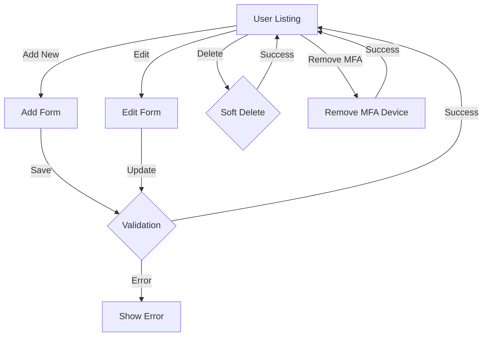
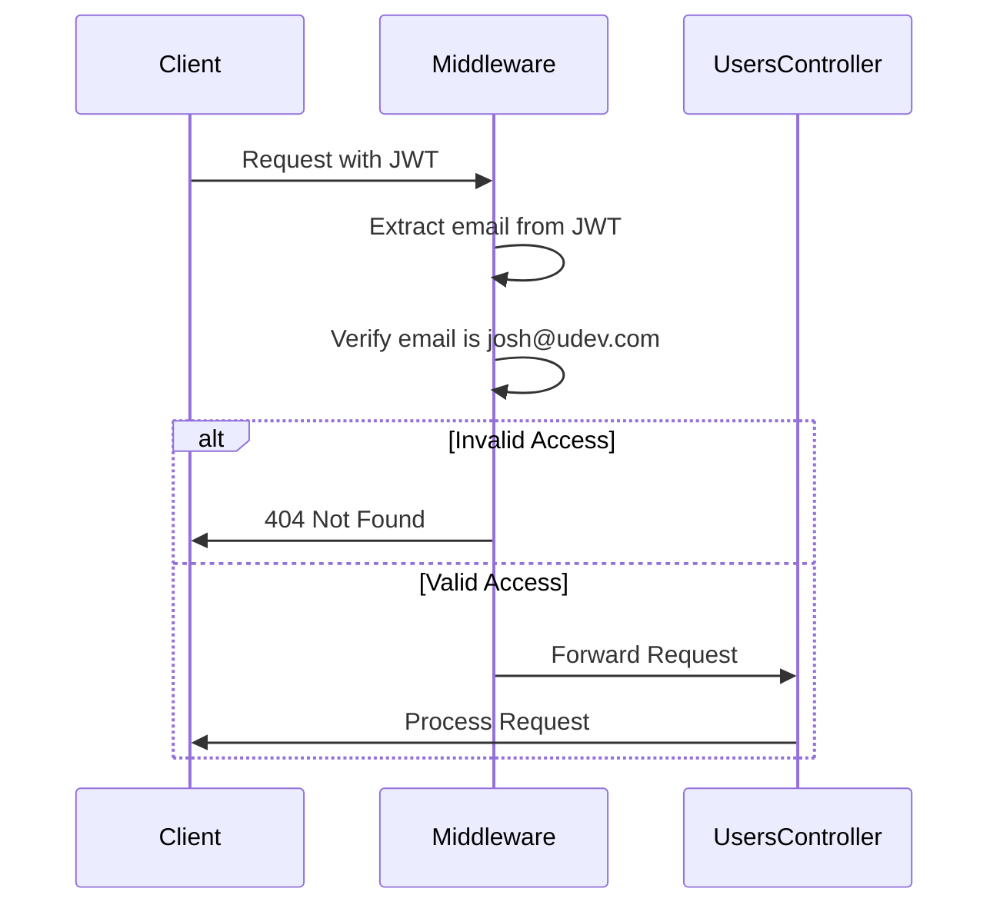

# Users Controller Documentation

## Overview
The `UsersController` manages user administration in the Health Deals Admin system. It provides functionality for user management, including CRUD operations and MFA device management. Access to this controller is restricted to admin users (specifically `josh@udev.com`).

## Dependencies
- `App\Models\User` - User model
- `Firebase\JWT` - JWT token validation
- `Firebase\JWT\Key` - JWT key handling

## Methods

### `index(Request $request, Response $response)`
Displays the user listing page.
- **Method**: GET
- **Route**: `/users`
- **Access**: Restricted to `josh@udev.com`
- **Template**: `users/index.php`
- **Response**: Rendered user listing page

### `add(Request $request, Response $response)`
Handles user creation.
- **Method**: GET/POST
- **Route**: `/users/add`
- **Access**: Restricted to `josh@udev.com`
- **POST Parameters**:
  - `email` (string) - User's email address
  - `password` (string) - User's password
  - `first_name` (string) - User's first name
  - `last_name` (string) - User's last name
  - `is_active` (boolean) - User's active status
- **Template**: `users/form.php`
- **Response**: Redirects to user listing on success

### `edit(Request $request, Response $response, array $args)`
Handles user updates.
- **Method**: GET/POST
- **Route**: `/users/edit/{id}`
- **Access**: Restricted to `josh@udev.com`
- **Parameters**: Same as `add()` method
- **Template**: `users/form.php`
- **Response**: Redirects to user listing on success

### `delete(Request $request, Response $response, array $args)`
Handles user deletion (soft delete).
- **Method**: POST
- **Route**: `/users/delete/{id}`
- **Access**: Restricted to `josh@udev.com`
- **Response**: Redirects to user listing

### `removeMfa(Request $request, Response $response, array $args)`
Removes MFA device from user account.
- **Method**: POST
- **Route**: `/users/remove-mfa/{id}`
- **Access**: Restricted to `josh@udev.com`
- **Response**: Redirects to user listing

## User Management Flow



## Features

### 1. User Management
- User CRUD operations
- Password management
- MFA device management
- Active status control
- Soft delete support

### 2. Access Control
- Admin-only access
- Email-based restrictions
- JWT token validation
- Session management

### 3. Security Features
- Password hashing
- MFA support
- Soft delete implementation
- Input validation
- CSRF protection

## Authorization

### Access Control Flow


## Error Handling

1. **Input Validation**:
   - Email uniqueness check
   - Required field validation
   - Password strength validation
   - Email format validation

2. **Access Control Errors**:
   - Unauthorized access handling
   - Invalid token handling
   - Session expiration handling
   - Permission denial handling

3. **Operation Errors**:
   - Database error handling
   - MFA removal errors
   - Update conflict resolution
   - Deletion error handling

## Usage Examples

### Web Interface
```php
// Add new user
POST /users/add
Content-Type: application/x-www-form-urlencoded

email=newuser@example.com&password=securepass&first_name=John&last_name=Doe&is_active=on

// Update user
POST /users/edit/123
Content-Type: application/x-www-form-urlencoded

email=updated@example.com&first_name=Updated&last_name=Name&is_active=on

// Delete user
POST /users/delete/123

// Remove MFA
POST /users/remove-mfa/123
```

## Security Considerations

### 1. Access Control
- Restricted to admin user
- JWT token validation
- Session management
- Request validation

### 2. Data Protection
- Password hashing
- MFA management
- Input sanitization
- CSRF protection
- XSS prevention

### 3. Audit Trail
- User action logging
- Modification tracking
- Access attempt logging
- Error logging

## Best Practices

### 1. User Creation
- Validate email uniqueness
- Enforce password policies
- Set appropriate defaults
- Send welcome emails
- Initialize MFA settings

### 2. User Updates
- Validate email changes
- Handle password updates
- Manage MFA changes
- Track modifications
- Maintain audit logs

### 3. User Deletion
- Implement soft deletes
- Handle dependencies
- Clean up related data
- Maintain referential integrity
- Log deletion events

## Implementation Details

### User Model Integration
```php
// Find user by email
User::findByEmail($email)

// Create new user
$user = new User(
    $email,
    $password,
    $firstName,
    $lastName,
    $isActive
);

// Update user
$user->setEmail($email);
$user->setPassword($password);
$user->setFirstName($firstName);
$user->setLastName($lastName);
$user->setIsActive($isActive);

// Soft delete user
$user->softDelete();
```

### Authentication Check
```php
private function getCurrentUserEmail(Request $request): ?string
{
    $token = $_COOKIE['auth_token'] ?? null;
    if (!$token) {
        return null;
    }

    try {
        $decoded = JWT::decode($token, new Key($_ENV['JWT_SECRET'], 'HS256'));
        return $decoded->email ?? null;
    } catch (\Exception $e) {
        return null;
    }
}
```

## Future Enhancements

1. **Role Management**:
   - Multiple admin roles
   - Permission levels
   - Role hierarchies
   - Access matrices

2. **User Analytics**:
   - Activity tracking
   - Login history
   - Action auditing
   - Usage statistics

3. **Enhanced Security**:
   - IP-based restrictions
   - Advanced MFA options
   - Session management
   - Security policies 